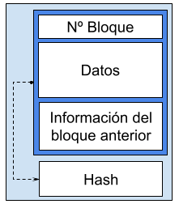
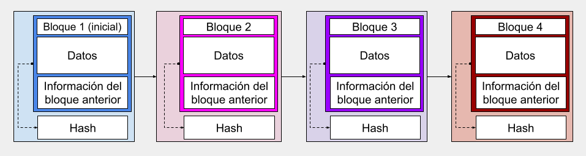
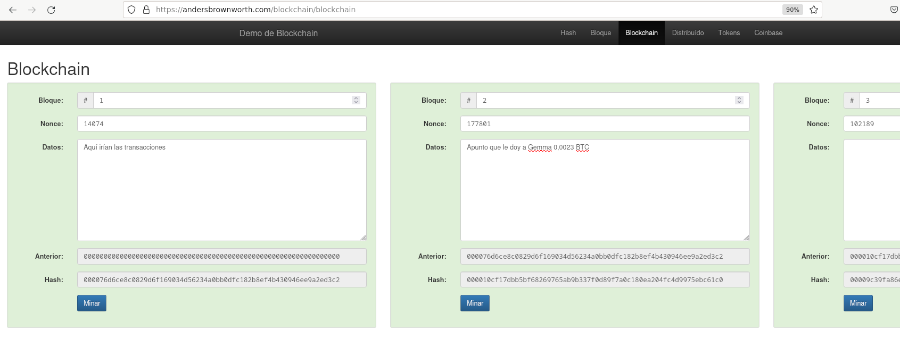
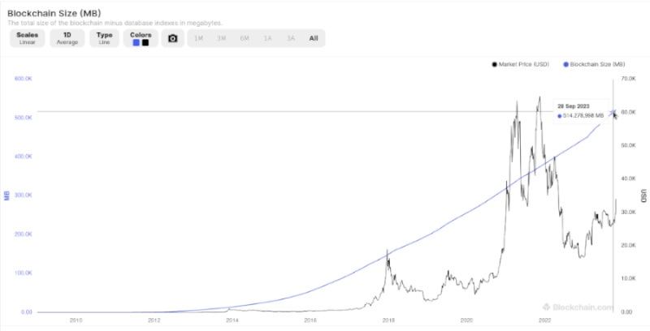
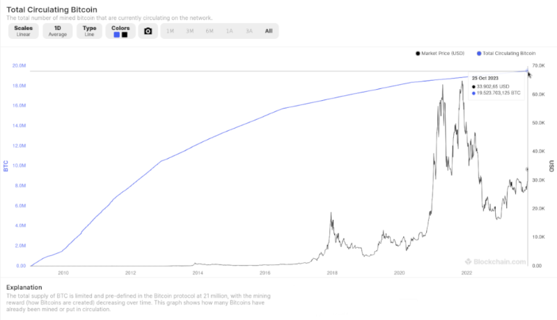
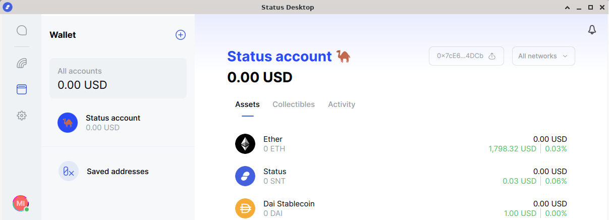
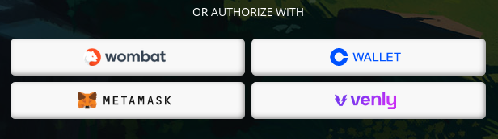

# Criptomonedas

CC-BY-SA <cmorenoruiz@educa.madrid.org>

Revisado 31/10/2023

## Origen de Bitcoin

* Octubre de 2008: Satoshi Nakamoto publicó un documento en una lista de correo de criptografía, que definía los protocolos y requisitos a cumplir por una moneda digital no centralizada y basada en criptografía.
* Enero de 2009: subió la versión del software Bitcoin y diez días después, Hal Finney recibió los primeros 10 BTC de la historia.

## Elementos de la red Bitcoin

* Base de Datos o registro de las operaciones (Distributed Ledger Technology), basada en blockchain o cadena de bloques.
* Nodo: un ordenador que tiene instalado el software Bitcoin y guarda una copia completa o parcial de todas las transacciones realizadas.
* Coin: moneda digital, en este caso Bitcoin (BTC).

___

* Minero: grupos de ordenadores que recibe recompensas en Tokens por validar y encriptar las transacciones en un bloque. Tienen que llegar a un consenso entre ellos para validar y cifrar.
* Consenso: normas que tienen que cumplirse para que los mineros validen un bloque. En Bitcoin se llama PoW (Proof of Work). Los consensos son diferentes dependiendo del tipo de red, es diferente para Bitcoin, Ethereum…

## Blockchain

### Funcionamiento resumido

1. Las solicitudes de transacción se añaden a un nuevo bloque, los mineros comprueban que son válidas,
2. cifran el nuevo bloque,
3. buscan un número que cumple ciertas condiciones al aplicarlo a ese bloque, el que lo consiga el primero o en menos pasos, lo añade a la BD y recibe una recompensa en BTC
4. Cada nodo replica ese cambio en su copia de la BD.
5. Se añade un bloque cada diez minutos.

### Ejemplo de bloque

[Consulta el bloque 814703](https://www.blockchain.com/explorer/blocks/btc/814703), minado por F2Pool, se le recompensó con 6.47983226 BTC.

### Política monetaria

* En 2009 por cerrar un bloque te recompensaban con 50 BTC.
* Cada 210 000 bloques, unos cuatro años, se reduce la recompensa a la mitad (_halving_).
* En mayo de 2020 eran 6,25 BTC y se espera que sea de 3,125 BTC en 2024.

1 BTC = 10 6 satoshis

A 31/03/2023: 1 BTC = 32.341,29€ y 1 satoshi= 0.03€

### Cadena de bloques

## Simulación

* [Prueba en esta web](https://andersbrownworth.com/blockchain/hash) el funcionamiento de la herramienta hash, bloque, blockchain, …

## Base de Datos de Bitcoin

Cada bloque añadido, aumenta el tamaño de la BD.
[Fuente: estadísticas de blockchain.org (consultado 29/10/2023)](https://www.blockchain.com/explorer/charts/total-bitcoins)

## Límite de BTC

Nunca habrá más de 21 millones.

[Fuente: estadísticas de blockchain.org (29/10/2023)](https://www.blockchain.com/es/explorer/charts/total-bitcoins)

## Rentabilidad del minado

### ¿Es rentable?

* Inicialmente cualquiera podía minar. Ahora hay que tener ordenadores muy potentes para poder conseguir la recompensa al minar.
* Será rentable dependiendo de lo que te cueste la luz, el equipo y de lo que te paguen.
* Hay quien mina en la nube.

## ¿Minará la gente los bloques, cuando no paguen BTC por minar?

## Cartera de BTC

### Funcionamiento

* Posees un par de claves pública y privada.
* La **pública** es visible y cualquiera puede verla y conocer tu saldo y transacciones, está todo en la BD.
* Sólo tú conoces tu clave **privada**, si la pierdes o te la roban, nadie te la puede resetear o devolver.
* Las **transacciones** las haces con tu clave **privada**.
  
### Ejemplos de transacciones

* [Usuario que recibió una transacción el 31/10/2023 en BTC](https://blockchair.com/es/bitcoin/address/bc1qcynkmtk9yh65wcep332z5ty9zzn8k35jve9q0m).
* Con otras monedas basadas en blockchain, tienes la misma información. [Aquí podéis ver las transacciones e información](https://etherscan.io/token/0xa117000000f279d81a1d3cc75430faa017fa5a2e?a=0xf60c2ea62edbfe808163751dd0d8693dcb30019c) del usuario "Binance US 3" con la moneda ANT.

## Smart contracts y oráculos

### Definición

Los **smart contracts** son una funcionalidad de Ethereum.
Son pequeños programas, que de manera automática, cuando se cumplen unas condiciones, realizan transferencias de monedas. Se ejecutan en máquinas virtuales

### Ejemplo

Se retrasa tu avión y la compañía de seguros te transfiere una indemnización automáticamente.
Eso lo haría un smart contact.

### Definición de oráculo

Los **oráculos** son programas servicios ajenos al smart contract, al que se le pide información, por ejemplo saber si el avión se ha retrasado.

### Smart contracts en Bitcoin

La propuesta inicial de Bitcoin para los contratos, no era fácil de implementar. Por eso Quixcoin y Ethereum, ambas plataformas con moneda propia basada en blockchain, se fusionaron y desarrollaron lo que ahora se conoce como RSK (Rootstock). Buscan ser "[turing completo](https://en.wikipedia.org/wiki/Turing_completeness)".

### Evolución de bitcoin mediante RSK

Funciona como una cadena paralela.

Fuente: IOVlabs en Criptonoticias

### Dónde se aprende o prueba

* Los desarrolladores prueban sus dApps (distributed apps) o smart contracts en webs de prueba, como [remix.ethereum.org](https://remix.ethereum.org).
* El lenguaje para programar dApps es Solidity, hay otros como Vyper, Lisk, Rust o Serpent.
* Prueba Solidity jugando en [cryptozombies.io](cryptozombies.io) (se recomienda saber programar en otro lenguaje).

### Listado de dApps basadas en blockchain

[Existía una web](https://www.stateofthedapps.com/) con listado de dApps, pero en octubre de 2023 no está accesible, [última vez realizada una copia, 09/12/2022.](https://web.archive.org/web/20220801000000*/https://www.stateofthedapps.com/) Pueden verse diferentes dApps en [https://dappradar.com/rankings/games](https://dappradar.com/rankings/games)

### Gas o gasto de computación

Que tengas una dApp funcionando, genera un gasto de la plataforma. En Ethereum se pagaba pujando por tu gasto en Gas, podía verse en [ethgasstation.info](https://ethgasstation.info), pero dejó de mostrar la información en julio 2023, porque hubo una propuesta para reducir las tasas de uso de red (EIP-1559 Ethereum Improvement Proposals-1559), que se aplica desde agosto de 2021.

### Tarifa

Actualmente, se paga una **tarifa base** que indicará la plataforma en el momento y la **propina** que tú quieras dejar al minero. Si es poca, tu smart contract o dApp podría no llegar a ejecutarse.

0,000000001 ether es equivalente a 1 gwei.

## Agrupaciones de criptomonedas

* Altcoin ALT: monedas alternativas a las más utilizadas (bitcoin, litecoin​ y ethereum).
* Shitcoin SHT: moneda digital sin valor, propósito o utilidad significativos.
* Stable Coins: diseñadas para minimizar la volatilidad de los precios y contrastan con criptoactivos más volátiles como el bitcoin. Buscan que el público conservador se acerque a las criptomonedas. Ejemplos 2018: Tether, Basis, Monerium, Haven …

___

* Privacy Coins: uno de sus objetivos es proteger la privacidad de los usuarios, con BTC podrían rastrearse. Ejemplos: Monero, ZCash... No pueden emplearse en smart contracts ni en algunos mercados de intercambio.

## Otras monedas

* [Zcash](https://z.cash/) ZEC
* [Monero](https://www.getmonero.org/) XMR
* [Ripple](https://ripple.com/) XRP
* Ether de [Ethereum](https://ethereum.org/es/)
* [Binance coin](https://www.binance.com/es/bnb) BNB
* [Stellar](https://stellar.org/)
* [Bitcoin Cash](https://bitcoincash.org/) BCH
Puede verse la situación de muchas monedas en <https://etherscan.io/tokens>

## Tokens vs coin

### ¿Qué es un token de tipo ERC-20 (Ethereum Requests for Comments?

* Un estándar propuesto para la red contractual de Ethereum. Es un smart contract. Tiene mejoras respecto a BTC en Bitcoin y facilita el trabajo a los desarrolladores.
* No tiene por qué ser una criptomoneda.
* Hay diferencias sutiles entre tokens y criptomonedas.

### No todos los tokens son criptomonedas  

Si la función principal de un token, es almacenar una cantidad de una moneda electrónica para poder intercambiarla, lo llamaremos criptomoneda, aunque seguirá siendo un token si cumple el estándar ERC-20.

Para más información: [https://crypto.com/university/crypto-tokens-vs-coins-difference](https://crypto.com/university/crypto-tokens-vs-coins-difference)

## Proyectos con  blockchain

### [Status](https://status.im/)

Beta (30/10/23). Incluirá mensajería, cartera de criptomonedas y navegador Web3.

### Otros

* [cosmos.network](https://cosmos.network/)  interoperabilidad entre blockchains.
* [aragon.org](aragon.org) proyecto español para la gestión de organizaciones y gobiernos descentralizados. Ofrece que te crees tu propia Decentralized Autonomous Organization (DAO) usando sus herramientas. Tienen su propio token Aragon Network Token (ANT)
* [steem.com:](steem.com) es una red social donde generar tus propios tokens.

### Brave

* [brave.com](brave.com) es un navegador cuyo objetivo es la privacidad, incluye una cartera de criptomonedas y te paga con ellas por ver publicidad

## Mercados de intercambio de divisas

___

* Centralizados (CEX): Coinbase, Okex, Binance, Bitstamp Bitfinex, BTC-e Krahen, Huobi
* Descentralizados (DEX): IDEX, Bankor, Stellar DEX, EtherDelta
* También los hay híbridos (HEX): Qurrex, Next, Eidoo, WAVEs  

___

* Importante saber dónde guardan estos mercados las monedas y las claves privadas.
* En 2018 al exchange coreano Coinrail le [hackearon, robaron millones de dólares](https://www.incibe.es/incibe-cert/publicaciones/bitacora-de-seguridad/40-millones-dolares-robados-criptomonedas) y hasta se redujo el valor del bitcoin.
* Se recomienda realizar las transacciones desde el ordenador y mediante una VPN.

___

* KYC y AML (Know Your Customer y Anti-money Laundering) son los métodos de verificación utilizados por entidades como nuestro banco, para evitar fraudes. Los mercados que elijamos deben implementar KYC y AML.
* Ejemplos de empresas que ofrecen servicio de compra de bitcoins en cajeros, con PayPal, tarjeta, integrados en apps...: [https://paxful.com/es](https://paxful.com/es),  [Athena Bitcoin](https://athenabitcoin.com/) antes [http://bitquick.co](http://bitquick.co) y [https://localbitcoins.com/](https://localbitcoins.com/), que dejó de funcionar en febrero de 2023.

## Criterios a la hora de elegir una criptomoneda

* Si es útil
* Si se basa en blockchain o en otra red
* ¿Cuándo se lanzó?
* Si está madura
* ¿Cuántas monedas se quedan los fundadores?
* Si hay un número máximo de monedas
* ¿Cómo se obtiene la moneda?

## Otros términos

___

* **DeFi**: Decentralized Finance [https://builtin.com/finance/defi-decentralized-finance](https://builtin.com/finance/defi-decentralized-finance)
* **Web3 browser**: navegador capaz de acceder a dApps, carteras y mercados de criptomonedas, servicios de DeFi… Te conectarías a los servicios a través de tu cartera. Como en [este juego](https://splinterlands.com/):  

___

* **ICO (Initial Coin Offering)**: Es un proceso de financiación, mediante el cual, los desarrolladores de un proyecto ofrecen al público una venta temprana de tokens o participaciones, para así poder recoger fondos y desarrollar el proyecto vinculado a dicho token ofrecido.

___

* **Tokens No Fungibles (Non Fungible Tokens NTF)**: tokens únicos que no pueden hacerse desaparecer y que suelen estar asociados a una obra de arte, entradas para un concierto, … el creador del NFT lo firma con su ID y lo añade a un blockchain. Puede venderlo, transferirlo… El token incluye los datos del propietario actual.  

___
Ejemplos de NFT:  

1. En ~~kryptokitties~~ podías comprarte un gato virtual con tokens únicos, [pero ya no funciona.](https://kryptokitties.co/)
2. En [https://opensea.io/](https://opensea.io/), [Rarible](https://rarible.com/) y [Superrare](https://superrare.com/) se comercia con ellos. Por ejemplo, [puedes comprar esta lámina.](https://superrare.com/0x47542736c9d1086dc87cc45138b2d57ec79eafa3/dual-apples-straddle-enigma-7)

## Bibliografía

* Ideas generales sacadas de "_Criptomonedas para Dummies_" Ronco Villadot, Víctor y Callejo, Carlos. 2020. Editorial CEAC. ISBN 9788432905926.
* [Evolución de RSK.](https://www.criptonoticias.com/criptopedia-old/rsk-plataforma-contratos-inteligentes-bitcoin-blockchain/)
* [Introducción de EIP-1559](https://academy.bit2me.com/que-es-eip-1559/)
* [Introducción a las propuestas de mejora de Ethereum (EIP)](https://ethereum.org/es/eips/)
* [Gas](https://ethereum.org/es/developers/docs/gas/) en Ethereum
* [Token ERC-20](https://academy.bit2me.com/que-es-erc-20-token/) dentro de las EIP-20
* [KYC y AML](https://www.mobbeel.com/blog/que-es-kyc-know-your-customer-y-aml-anti-money-laundering/)

___

* [Shitcoins](https://labeabogados.com/asesoria-fiscal-contable/asesoria-en-criptomonedas/que-es-una-shitcoin-y-que-riesgos-asumes-cuando-las-compras/)
* [Informe sobre Stablecoins](https://www.blockchain.com/static/pdf/StablecoinsPPTFinal.pdf) según Blockchain.com en 2018
* [Privacy Coins](https://builtin.com/blockchain/privacy-coins)
* [Web3 Browser](https://brave.com/es/web3/what-are-web3-browsers/)
* [ICO](https://es.cointelegraph.com/explained/what-is-an-ico-myths-and-realities-surrounding-initial-coin-offering)
* [NFTs](https://brave.com/es/web3/what-are-nfts/)
* [Hackeo a Coinrail](https://www.incibe.es/incibe-cert/publicaciones/bitacora-de-seguridad/40-millones-dolares-robados-criptomonedas)
